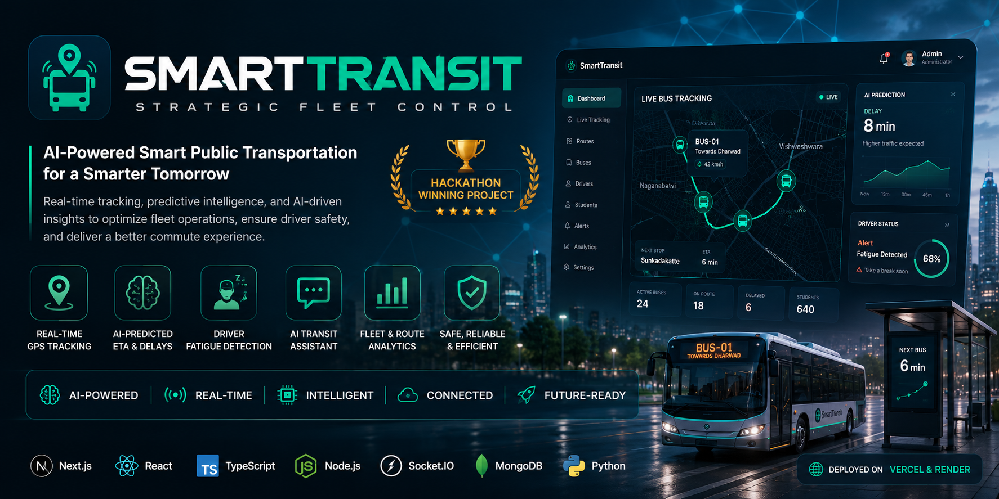

<p align="center">
  
</p>

# 🚍 SmartTransit

> 🏆 **Hackathon Winning Project**
>
> An AI-powered intelligent public transportation platform that modernizes fleet management through real-time GPS tracking, predictive analytics, driver fatigue detection, AI assistance, and live transit monitoring.

<p align="center">


</p>

---

## 🌟 Highlights

- 🏆 Hackathon Winning Project
- 🚍 AI-powered Smart Transit Platform
- 📍 Real-time GPS Bus Tracking
- ⚡ Socket.IO Live Communication
- 🤖 AI Transit Assistant
- 🧠 Driver Fatigue Detection
- 📊 Predictive ETA & Delay Analytics
- 👨‍💼 Multi-role Dashboard (Admin • Driver • Student)
- ☁️ Production Deployment on Vercel & Render

---

# 📖 Overview

SmartTransit is a modern intelligent transportation management platform built to improve public transit through real-time communication, artificial intelligence, and predictive analytics.

The platform provides a complete ecosystem for students, drivers, and administrators by combining live vehicle tracking, intelligent ETA prediction, fatigue monitoring, AI-powered assistance, and centralized fleet management into a single scalable application.

Unlike traditional GPS tracking systems, SmartTransit focuses on operational intelligence by integrating machine learning, real-time sockets, and cloud-native architecture to enhance both passenger experience and fleet efficiency.

---

# ✨ Features

## 🚍 Real-Time Fleet Management

- Live Bus Tracking
- GPS Position Updates
- Route Monitoring
- Arrival Notifications
- Bus Assignment
- Driver Console

---

## 🤖 AI Features

- AI Transit Assistant
- Delay Prediction
- Smart ETA Estimation
- Operational Insights
- Intelligent Route Suggestions

---

## 😴 Driver Safety

- AI Fatigue Detection
- Driver Monitoring
- Safety Alerts
- Health Status Tracking

---

## 👥 User Portals

### 👨‍💼 Admin

- Fleet Management
- Route Management
- Driver Management
- Student Management
- Analytics Dashboard

### 🚌 Driver

- Start / End Trips
- Live GPS Broadcast
- Boarding Status
- Emergency Controls
- Route Navigation

### 🎓 Student

- Live Bus Tracking
- ETA Prediction
- Bus Status
- Boarding Updates
- Route Information

---

# 🏗 System Architecture

```
                    SmartTransit

                Next.js Frontend
                       │
        ┌──────────────┼──────────────┐
        │              │              │
        │              │              │
   Socket Service   Fatigue API   AI Services
      (Node.js)       (Python)    (OpenRouter)

                       │
                 MongoDB Database
```

The application follows a modular architecture by separating real-time communication and AI services into dedicated backend services, improving scalability and maintainability.

---

# 💻 Tech Stack

## Frontend

- Next.js
- React
- TypeScript
- Tailwind CSS
- GSAP

## Backend

- Node.js
- Express.js
- Socket.IO

## AI & Machine Learning

- OpenRouter API
- Python
- Fatigue Detection Service

## Database

- MongoDB

## Authentication

- NextAuth

## Deployment

- Vercel
- Render

---

# 📂 Project Structure

```
SmartTransit
│
├── app/
├── components/
├── lib/
├── models/
├── public/
├── socket-service/
├── fatigue-service/
├── scripts/
├── types/
├── README.md
└── .env.example
```

---

# ⚡ Getting Started

## Clone Repository

```bash
git clone https://github.com/imjoe77/SmartTransit.git
```

```bash
cd SmartTransit
```

Install dependencies

```bash
npm install
```

Run development server

```bash
npm run dev
```

---

# 🔐 Environment Variables

Create a `.env.local`

Example

```env
MONGODB_URI=

NEXTAUTH_URL=

NEXTAUTH_SECRET=

GOOGLE_CLIENT_ID=

GOOGLE_CLIENT_SECRET=

GITHUB_CLIENT_ID=

GITHUB_CLIENT_SECRET=

OPENROUTER_API_KEY=

NEXT_PUBLIC_SOCKET_URL=

SOCKET_SERVICE_URL=

SOCKET_SERVICE_TOKEN=

FATIGUE_SERVICE_URL=
```

---

# 🌐 Deployment

Frontend

- Vercel

Backend Services

- Render

Database

- MongoDB Atlas

---


> Add screenshots here

- Landing Page
- Admin Dashboard
- Driver Dashboard
- Student Tracking
- AI Assistant
- Route Management
- Driver Fatigue Detection
- Mobile Interface

---

# 🚀 Future Improvements

- Push Notifications
- Offline Bus Tracking
- Mobile Application
- Predictive Traffic Analysis
- Attendance Automation
- Multi-City Support
- Fleet Optimization AI
- Voice Assistant

---

# 🤝 Contributing

Contributions are welcome!

If you'd like to improve SmartTransit:

1. Fork the repository
2. Create a feature branch
3. Commit your changes
4. Open a Pull Request

---

# 📄 License

This project is licensed under the **MIT License**.

See the [LICENSE](LICENSE) file for details.

MIT License Template:
https://opensource.org/licenses/MIT

---

# 👨‍💻 Author

**Nathaniel Bandi**

GitHub:
https://github.com/imjoe77

---

⭐ If you found this project interesting, consider giving it a star!
